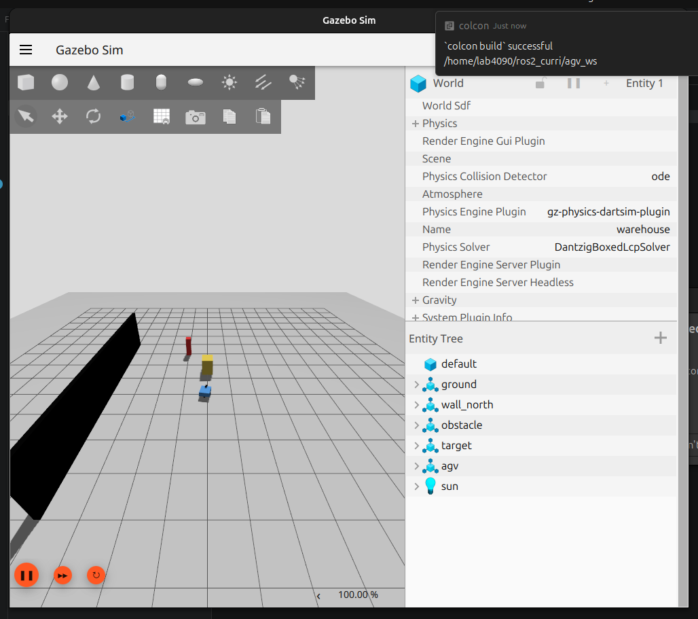

# M08 — Gazebo World와 AGV Spawn

## 목표

SDF World에 바닥·벽·장애물·목표물을 두고 AGV 모델을 Gazebo Harmonic에서 실행합니다.

## 이번 구간에서 만드는 파일

| 파일 | 역할 |
| --- | --- |
| `agv_ws/src/agv_gazebo/worlds/warehouse.sdf` | 조명, 물리, 바닥, 벽, 장애물이 있는 World입니다. |
| `agv_ws/src/agv_gazebo/models/agv/model.config` | Gazebo model URI가 읽는 모델 메타데이터입니다. |
| `agv_ws/src/agv_gazebo/models/agv/model.sdf` | AGV 물리·센서·DiffDrive plugin 모델입니다. |
| `agv_ws/src/agv_gazebo/launch/gazebo.launch.py` | World와 resource path를 ROS launch에서 시작합니다. |

## 만드는 순서

1. World에 `Physics`, `UserCommands`, `SceneBroadcaster`, `Sensors` system plugin을 넣습니다.
2. model 폴더를 패키지 share로 설치하고 launch에서 `GZ_SIM_RESOURCE_PATH`에 models 경로를 추가합니다.
3. World의 `<include><uri>model://agv</uri></include>`가 `models/agv/model.config`를 찾습니다.
4. Gazebo 창이 열리면 Inspector에서 `agv` model과 wheel joint를 확인합니다.

```bash
cd ~/ros2_curri/agv_ws
colcon build --symlink-install --packages-select agv_gazebo agv_description
source install/setup.bash
ros2 launch agv_gazebo gazebo.launch.py
```

## 확인

Gazebo에서 floor, 벽, 빨간 target, AGV가 모두 보이고 실행 직후 AGV가 안정적으로 바닥에 놓이면 통과입니다.

## 명령어가 하는 일과 바꿔 볼 값

| 명령어 | 실제 동작 | 바꿔 볼 값 |
| --- | --- | --- |
| `ros2 launch agv_gazebo gazebo.launch.py` | `gazebo.launch.py`가 `GZ_SIM_RESOURCE_PATH`에 패키지의 `models/`를 추가하고, `ros_gz_sim`에 `-r warehouse.sdf`를 전달해 실행 상태의 Gazebo를 시작합니다. 이어서 bridge YAML을 읽는 `parameter_bridge`도 시작합니다. | launch 인자를 확인하려면 `ros2 launch agv_gazebo gazebo.launch.py --show-args`를 사용합니다. World를 바꾸려면 launch 코드의 `world` 경로를 다른 `.sdf`로 바꿉니다. |
| `gz topic -l` | 실행 중인 Gazebo Transport의 실제 토픽 이름을 나열합니다. ROS 토픽 목록과 다른 계층입니다. | bridge가 안 될 때 이 목록의 이름을 `bridge.yaml`의 `gz_topic_name`과 비교합니다. |
| Gazebo Inspector | 실행 중인 entity, link, joint 속성을 GUI에서 관찰합니다. 파일을 바꾸는 명령은 아닙니다. | `agv` model을 선택해 wheel joint와 link pose가 예상 위치인지 확인합니다. |

## 내부 구현과 실행 뒤 보이는 결과

`warehouse.sdf`는 floor·벽·장애물·target을 가진 월드이고, 그 안의 `model://agv` include는 `model.config`를 거쳐 `models/agv/model.sdf`를 찾습니다. launch 파일이 resource path를 설정하는 이유도 `model://agv` URI가 현재 패키지의 모델 폴더를 찾게 하기 위해서입니다. World의 Physics·Sensors system plugin은 시간 진행·센서 업데이트를 담당합니다.

정상 실행 화면에는 바닥, 벽/장애물, 빨간 target, 파란 AGV가 함께 나타납니다. 터미널에는 Gazebo 서버와 bridge 프로세스가 시작된 로그가 보이며, `gz topic -l`에는 SDF가 만든 `/cmd_vel`, `/odom`, `/scan`, `/imu/data`, `/camera/image_raw` 등이 나타납니다. `model://agv`를 못 찾는 오류는 SDF보다 `GZ_SIM_RESOURCE_PATH`와 설치된 model 폴더를 먼저 점검할 신호입니다.

## 실제 Gazebo 실행 화면

아래 캡처는 이 저장소의 `agv_sim.launch.py`를 실제 실행해 Gazebo Sim에 `warehouse` World와 `agv` entity가 올라온 화면입니다. Entity Tree의 `agv`가 SDF 모델이 실제로 spawn된 증거입니다.


