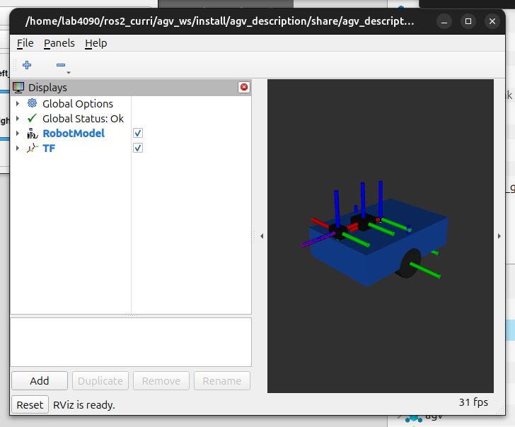

# M11 — RViz2 통합 검증

## 목표와 파일

`agv_description/rviz/agv.rviz`는 RobotModel/TF의 출발점이고, `agv_bringup/launch/agv_sim.launch.py`는 최종적으로 RViz를 같이 실행합니다.

## 만드는 순서

1. Gazebo launch를 실행합니다.
2. 별도 터미널에서 `rviz2`를 실행하고 Fixed Frame을 먼저 `odom`으로 정합니다.
3. Add 메뉴로 RobotModel, TF, Odometry(`/odom`), LaserScan(`/scan`), Image를 추가합니다.
4. RobotModel이 TF와 맞지 않으면 M04의 `robot_state_publisher`도 실행해야 합니다.

```bash
ros2 run tf2_tools view_frames
ros2 topic hz /scan
ros2 topic echo /odom --once
```

## 확인

RViz에서 RobotModel, TF, Odometry, LaserScan 네 개가 같은 위치를 가리키는지 봅니다. 데이터는 오는데 화면이 비면 `Fixed Frame`, 메시지 `frame_id`, TF tree 순으로 검사합니다.

## 명령어가 하는 일과 바꿔 볼 값

| 명령어 | 실제 동작 | 바꿔 볼 값 |
| --- | --- | --- |
| `rviz2` | ROS topic과 TF를 구독해 3D로 그리는 시각화 프로그램만 시작합니다. Gazebo나 로봇 노드를 대신 실행하지 않습니다. | Fixed Frame을 `odom`으로 두고, RobotModel·TF·Odometry·LaserScan·Image display의 topic을 각각 지정합니다. |
| `ros2 run tf2_tools view_frames` | 현재 TF tree의 연결을 수집해 PDF로 저장합니다. RViz가 빈 이유가 TF 단절인지 확인할 때 사용합니다. | `base_link`가 `odom`까지 연결되는지, scan의 frame이 tree 안에 있는지 확인합니다. |
| `ros2 topic hz /scan` | 두 LaserScan 메시지 사이 시간으로 평균 주파수를 계산합니다. 메시지 내용은 출력하지 않습니다. | 현재 SDF의 LiDAR `update_rate`는 10 Hz이므로 이 값 근처를 기대합니다. |

## 내부 구현과 실행 뒤 보이는 결과

Gazebo DiffDrive는 `/odom`과 `odom → base_link` 기준을 만들고, `robot_state_publisher`는 URDF의 `base_link → wheel/sensor` 변환을 만듭니다. RViz는 이 두 변환 묶음을 이용해 LaserScan의 `header.frame_id`와 RobotModel을 한 좌표계로 변환합니다. 따라서 scan 데이터가 있어도 `lidar_link`가 TF tree에 없으면 점들이 화면에서 사라지거나 Fixed Frame 오류가 납니다.

정상 화면에서는 파란 AGV 본체, TF 축, odom 위치, LiDAR 반사점이 같은 지점을 기준으로 움직입니다. `/scan`의 frame이 `lidar_link`, odom의 child frame이 `base_link`로 보이는 것이 기대 결과입니다. 이미지가 필요할 때는 Camera display의 topic을 `/camera/image_raw`로 설정하고, bridge가 실제 Image 메시지를 보내는지 먼저 `ros2 topic echo /camera/image_raw --once`로 확인합니다.

## 실제 RViz 실행 화면

아래는 실제 `display.launch.py`를 실행해 URDF/xacro의 파란 AGV body, 양쪽 wheel, camera·LiDAR·IMU sensor housing과 TF frame을 RViz에 렌더링한 캡처입니다. RViz 설정은 Jazzy의 `/robot_description` topic을 읽도록 구성되어 있습니다.


